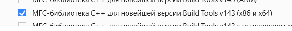

  <strong>🌐 Язык: </strong>
  
  
    ✅ 🇷🇺 Русский (текущий)
  
  | 
  <a href="./README.md" style="color: #0891b2; margin: 0 10px;">
    🇺🇸 English
  </a>

---

> [!NOTE]
> Этот проект является частью экосистемы **Lizerium** и относится к направлению:
>
> - [`Lizerium.Software.Structs`](https://github.com/Lizerium/Lizerium.Software.Structs)
>
> Если вы ищете связанные инженерные и вспомогательные инструменты, начните оттуда.

> **26.11.2020 23:26 - по настоящее время**

# ⏬Описание⏬

FLHook(**_8.0.0_**)

> ## Версия: **Dvurechensky**
>
> ## Игра: **Freelancer Lizerium**

Это изначально частный репозиторий **FLHook** от **Freelancer Lizerium**.
Гибрид репозиториев большого количества мертвых серверов Freelancer.
В него включены клиентский хук и много плагинов под него.

> [!WARNING]
> Данный проект - был протестирован успешно на [Lizerium](https://lizup.ru/) сервере от меня [Dvurechensky](https://www.dvurechensky.pro/)

> [!CAUTION]
> Если вы увидели этот проект в общем доступе значит я решил поделиться с вами не только этим проектом но и всем [Lizerium](https://lizup.ru/)

### Документация

- [Разработка плагинов для FLHook](<docs/PLUGIN_DOCS/Разработка плагинов для FLHook.ru.md>)
- [Available Hooks — Хуки FLHook](<docs/PLUGIN_DOCS/Available Hooks — Хуки FLHook.ru.md>)
- [Plugin How-To для FLHook](<docs/PLUGIN_DOCS/Plugin How-To для FLHook.ru.md>)
- [SDK Files & Inter-Plugin Communication для FLHook](<docs/PLUGIN_DOCS/SDK Files & Inter-Plugin Communication для FLHook.ru.md>)
- [Troubleshooting для FLHook Plugins](<docs/PLUGIN_DOCS/Troubleshooting для FLHook Plugins.ru.md>)
- [Boost](docs/BOOST_DEPENDENCIES.ru.md)

### 🈴ВАЖНО: МНЕ НИКТО НЕ ПОМОГАЛ, ВСЕ ОТКАЗАЛИСЬ ИЛИ ПРОИГНОРИРОВАЛИ🈴

- Этот проект настроен для работы в **Visual Studio 2022 Professional**.
- Версия **Windows SDK - 8.1**.
- Компилятор - **VC141**.
- 

## 📳Как пользоваться📳

- Не используйте решение в конфигурации **DEBUG**. **Всегда** используйте **RELEASE**🌱 **WIN32**🌱
- Ваши скомпилированные плагины находятся в **Binaries/bin-vc14/flhook_plugins** - `ПОЧТИ`, часть в папках Release соответствующих плагинов.

## 📳Спецификация📳

### 📳Оглавление📳

1. [AFK](#AFK) | [README](src/Plugins/Public/afk/README.ru.md)
2. [ALLEY](#ALLEY) | [README](src/Plugins/Public/alley/README.ru.md)
3. [AUTOBUY](#AUTOBUY) | [README](src/Plugins/Public/autobuy/README.ru.md)
4. [BALANCE MAGIC](#BALANCE-MAGIC) | [README](src/Plugins/Public/balancemagic/README.ru.md)
5. [BANKER](#BANKER) | [README](src/Plugins/Public/banker/README.ru.md)
6. [BASE](#BASE) | [README](src/Plugins/Public/base_plugin/README.ru.md)
7. [BEAM ME UP](#BEAM-ME-UP) | [README](src/Plugins/Public/beammeup/README.ru.md)
8. [BOUNTY HUNT](#BOUNTY-HUNT) | [README](src/Plugins/Public/bountyhunt/README.ru.md)
9. [BUILD](#BUILD) | [README](src/Plugins/Public/builds/README.ru.md)
10. [CLOAK VERSION 2](#CLOAK-VERSION-2) | [README](src/Plugins/Public/cloak_plugin/README.ru.md)
11. [CLOAK VERSION 1](#CLOAK-VERSION-1) | [README](src/Plugins/Public/cloak_kosa/README.ru.md)
12. [COMMODITY LIMIT](#COMMODITY-LIMIT) | [README](src/Plugins/Public/commoditylimit/README.ru.md)
13. [CONNECTION](#CONN) | [README](src/Plugins/Public/conn_plugin/README.ru.md)
14. [DOCK RESTRICT](#DOCK-RESTRICT) | [README](src/Plugins/Public/dockrestrict/README.ru.md)
15. [DOCK TAG](#DOCK-TAG) | [README](src/Plugins/Public/docktag/README.ru.md)
16. [DRONE TYPES](#DRON-BAYS) | [README](src/Plugins/Public/dronebays/README.ru.md)
17. [DYNAMIC MISSION 2](#DYNAMIC-MISSION-2) | [README](src/Plugins/Public/dynamic_mission_2/README.ru.md)
18. [EVENT](#EVENT) | [README](src/Plugins/Public/event/README.ru.md)
19. [FAST START](#FAST-START) | [README](src/Plugins/Public/fast_start/README.ru.md)
20. [FTL](#FTL) | [README](src/Plugins/Public/ftl/README.ru.md)
21. [HELP](#HELP) | [README](src/Plugins/Public/help_expanded/README.ru.md)
22. [GETREP](#GET-REP) | [README](src/Plugins/Public/getrep/README.ru.md)
23. [ITEM RESTRICTIONS](#ITEM-RESTRICTIONS) | [README](src/Plugins/Public/item_restrict/README.ru.md)
24. [JSON BUDDY](#JSON-BUDDY) | [README](src/Plugins/Public/JSONBuddy/README.ru.md)
25. [KILL COUNTER](#KILL-COUNTER) | [README](src/Plugins/Public/killcounter/README.ru.md)
26. [LZ COMPAT](#LZ-COMPAT) | [README](src/Plugins/Public/LZCompat/README.ru.md)
27. [MARK](#MARK) | [README](src/Plugins/Public/mark/README.ru.md)
28. [MARKET FUCKER](#MARKET-FUCKER) | [README](src/Plugins/Public/MarketFucker/README.ru.md)
29. [MINE CONTROLE VERSION 1](#MINE-CONTROLE-VERSION-1) | [README](src/Plugins/Public/minecontrol_plugin/README.ru.md)
30. [MISCELLANEOUS COMMANDS](#MISCELLANEOUS-COMMANDS) | [README](src/Plugins/Public/MiscellaneousCommands/README.ru.md)
31. [NPC CONTROL](#NPC-CONTROL) | [README](src/Plugins/Public/npc_control/README.ru.md)
32. [REG ARMOUR](#REG-ARMOUR) | [README](src/Plugins/Public/reg_armour/README.ru.md)
33. [TEMP BAN](#TEMP-BAN) | [README](src/Plugins/Public/tempban/README.ru.md)
34. [TEMPLATE](#TEMPLATE) | [README](src/Plugins/Public/__PLUGIN_TEMPLATE/README.ru.md)
35. [PVE CONTROLLER](#PVE-CONTROLLER) | [README](src/Plugins/Public/pvecontroller/README.ru.md)
36. [STORAGE](#STORAGE) | [README](src/Plugins/Public/storage/README.ru.md)
37. [PLAYER CONTROLLER](#PLAYER-CONTROLLER) | [README](src/Plugins/Public/playercntl_plugin/README.ru.md)

---

> **26.11.2020 23:26 - по настоящее время**
