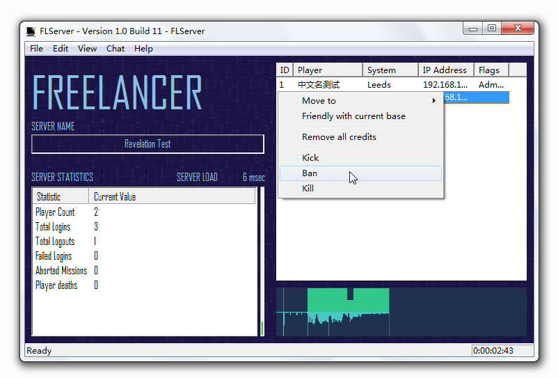

# Revelation Mod FLHook Plugin

Плагин для FLHook, созданный для корректной и удобной работы **Revelation Mod** в Freelancer.


---

## Описание

Этот плагин добавляет вспомогательные инструменты и внутренние интерфейсы, упрощающие:

- администрирование сервера
- работу с данными модификации
- разработку других плагинов поверх него

---

## Возможности

### Панель быстрых действий администратора

При включении плагин отображает **панель управления** в правой части главного окна **FLServer**.

Она позволяет администратору сервера выполнять действия над игроками **простыми кликами мыши**, без необходимости постоянно вводить команды вручную.

Подходит для:

- управления онлайн-игроками
- ускоренного администрирования
- удобной работы с сервером во время запуска

---

### Доступ к внутренним данным

Плагин предоставляет доступ к своим внутренним структурам данных и интерфейсам инструментов.

Это упрощает разработку других плагинов, которым нужны:

- игровые данные игроков
- информация о базах
- принадлежность к фракциям
- другие внутренние объекты мода

---

## Пример использования

Пример получения названия фракции, владеющей базой:

```cpp
wstring factionName = Data::getBase(L"li01_01_base")->getFaction()->getName();
```

То есть теперь можно работать с данными мода напрямую, без постоянного ручного парсинга и обходных решений.

---

## Для кого это полезно

Плагин особенно полезен, если ты:

- администрируешь сервер Revelation Mod
- пишешь собственные FLHook-плагины
- хочешь быстрее получать игровые данные из мода
- строишь дополнительные инструменты поверх сервера

---

## Исходный код

Исходный код находится в открытом доступе.

Лицензия фактически свободная — можно использовать как угодно.

---

## Назначение

Этот плагин — скорее **инфраструктурный слой**, чем просто игровой модуль.
Он делает серверную часть Revelation Mod удобнее как для администраторов, так и для разработчиков.

---
